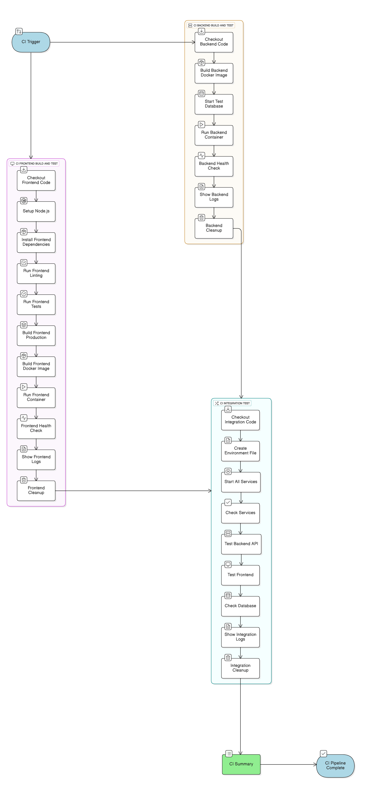
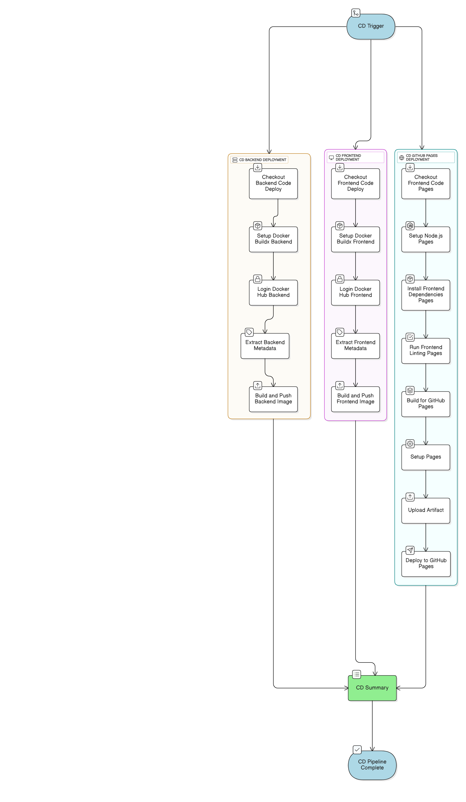
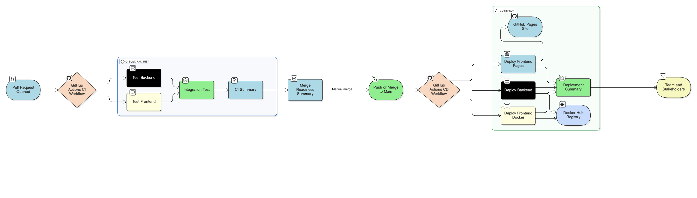

# DevOps Implementation Report

## Project Overview

This report documents the complete DevOps implementation for a full-stack web application consisting of a React frontend, FastAPI backend, and MongoDB database. The project demonstrates enterprise-level containerization, continuous integration, and automated deployment workflows.

## Technologies Used

### Application Stack
- **Frontend**: React 19.1.0 with Vite 6.3.5 build tool
- **Backend**: FastAPI (Python 3.12) with uvicorn server
- **Database**: MongoDB latest with mongosh client
- **Package Management**: 
  - Frontend: npm
  - Backend: uv (Astral's Python package manager)

### DevOps Tools
- **Containerization**: Docker and Docker Compose V2
- **CI/CD Platform**: GitHub Actions
- **Container Registry**: Docker Hub (https://hub.docker.com/r/madmunchkin/devops-frontend and https://hub.docker.com/r/madmunchkin/devops-backend)
- **Deployment**: GitHub Pages for frontend static hosting ( link : https://ahmad1015.github.io/DevOps-Lab-Mid/)
- **Version Control**: Git with GitHub ( link : https://github.com/Ahmad1015/DevOps-Lab-Mid)

### Development Tools
- **Linting**: ESLint and Prettier for frontend code quality
- **Testing Framework**: Vitest for frontend unit tests
- **API Documentation**: FastAPI automatic OpenAPI documentation
- **Reverse Proxy**: Nginx for production frontend serving

## Pipeline Design

### Continuous Integration (CI) Pipeline

The CI pipeline is triggered on pull requests to the main branch and consists of three parallel jobs followed by a summary job:

#### Job 1: Backend Build and Test
1. **Checkout Code**: Retrieves source code from repository
2. **Build Docker Image**: Creates containerized backend using multi-stage Dockerfile with uv package manager
3. **Start Test Database**: Launches MongoDB container with test credentials
4. **Run Backend Container**: Deploys backend with test environment variables
5. **Health Check**: Validates API endpoints including /docs and /api/v1/login/test-token
6. **Show Logs**: Displays container logs for debugging
7. **Cleanup**: Removes test containers and networks

#### Job 2: Frontend Build and Test
1. **Checkout Code**: Retrieves source code from repository
2. **Setup Node.js**: Configures Node.js 22 environment with npm caching
3. **Install Dependencies**: Runs npm ci for reproducible builds
4. **Run Linting**: Executes ESLint to enforce code quality standards
5. **Run Tests**: Executes Vitest test suite
6. **Build Production**: Compiles production-ready frontend bundle
7. **Build Docker Image**: Creates multi-stage Docker image with Nginx
8. **Run Frontend Container**: Deploys frontend on port 80
9. **Health Check**: Validates HTTP responses
10. **Show Logs**: Displays container logs for debugging
11. **Cleanup**: Removes test containers

#### Job 3: Integration Test
1. **Checkout Code**: Retrieves source code from repository
2. **Create Environment File**: Generates .env with test configuration
3. **Start All Services**: Launches complete stack using Docker Compose
4. **Check Services**: Verifies MongoDB, backend, and frontend are running
5. **Test Backend API**: Validates API endpoint functionality
6. **Test Frontend**: Confirms frontend is serving correctly
7. **Check Database**: Queries MongoDB to verify data persistence
8. **Show Logs**: Displays all service logs
9. **Cleanup**: Tears down complete stack

#### Job 4: CI Summary
Generates comprehensive summary report showing status of all tests and overall pipeline result.

### Continuous Deployment (CD) Pipeline

The CD pipeline is triggered on pushes to the main branch and consists of three parallel deployment jobs:

#### Job 1: Backend Deployment to Docker Hub
1. **Checkout Code**: Retrieves source code from repository
2. **Setup Docker Buildx**: Configures advanced Docker build capabilities
3. **Login to Docker Hub**: Authenticates using encrypted secrets
4. **Extract Metadata**: Generates image tags (latest, branch name, commit SHA)
5. **Build and Push**: Creates and uploads Docker image with caching

#### Job 2: Frontend Deployment to Docker Hub
1. **Checkout Code**: Retrieves source code from repository
2. **Setup Docker Buildx**: Configures advanced Docker build capabilities
3. **Login to Docker Hub**: Authenticates using encrypted secrets
4. **Extract Metadata**: Generates image tags
5. **Build and Push**: Creates production image with Nginx and uploads

#### Job 3: Frontend Deployment to GitHub Pages
1. **Checkout Code**: Retrieves source code from repository
2. **Setup Node.js**: Configures Node.js environment
3. **Install Dependencies**: Runs npm ci
4. **Run Linting**: Ensures code quality before deployment
5. **Build for GitHub Pages**: Compiles frontend with correct base path
6. **Setup Pages**: Configures GitHub Pages deployment
7. **Upload Artifact**: Prepares dist folder for deployment
8. **Deploy**: Publishes to GitHub Pages

#### Job 4: Deployment Summary
Generates deployment report with Docker pull commands and GitHub Pages URL.

### Pipeline Diagram

## Containerization Strategy

### Docker Compose Configuration

The docker-compose.yml file orchestrates three services:

**Database Service (MongoDB)**
- Uses official MongoDB latest image
- Exposes port 27017
- Implements health check using mongosh ping command
- Configures authentication with environment variables
- Persists data using named volume

**Backend Service (FastAPI)**
- Builds from custom Dockerfile using Python 3.12
- Exposes port 8000
- Waits for database health check before starting
- Runs with hot-reload for development
- Mounts source code as volume for live updates
- Excludes .venv directory to prevent conflicts

**Frontend Service (React + Vite)**
- Builds from development Dockerfile using Node.js 22
- Exposes port 5173
- Runs Vite development server with host flag
- Mounts source code for hot module replacement
- Excludes node_modules from volume mount

All services communicate through Docker's default bridge network, with the backend connecting to database using service name "db" as hostname.

### Dockerfile Optimization

**Backend Dockerfile**
- Multi-stage build not used but implements layer caching
- Uses uv for fast Python dependency installation
- Copies dependencies files first to leverage Docker layer caching
- Compiles Python bytecode for performance
- Sets Python unbuffered mode for better logging
- Default command runs FastAPI with 4 workers for production

**Frontend Production Dockerfile**
- Implements multi-stage build pattern
- Stage 1 (builder): Installs dependencies and builds production bundle
- Stage 2 (nginx): Serves static files with optimized Nginx configuration
- Removes default Nginx files for clean deployment
- Significantly reduces final image size

**Frontend Development Dockerfile**
- Single-stage build for faster development iterations
- Installs all dependencies including dev tools
- Does not build production bundle
- Suitable for hot-reload development workflow

## Secret Management Strategy

### GitHub Secrets Configuration

The project uses GitHub repository secrets for sensitive data:

**Docker Hub Credentials**
- DOCKER_HUB_USERNAME: Docker Hub account username
- DOCKER_HUB_TOKEN: Docker Hub access token (not password)

**Optional Secrets**
- BACKEND_API_URL: Backend deployment URL for frontend
- GA_TRACKING_ID: Google Analytics tracking identifier

### Environment Variables

Runtime configuration uses .env file with following variables:
- MONGO_USER: Database username
- MONGO_PASSWORD: Database password
- MONGO_DB: Database name
- PROJECT_NAME: Application name
- FIRST_SUPERUSER: Initial admin email
- FIRST_SUPERUSER_PASSWORD: Initial admin password
- BACKEND_CORS_ORIGINS: Allowed frontend origins
- VITE_BACKEND_API_URL: Backend API endpoint
- VITE_PWD_SIGNUP_ENABLED: Toggle password signup
- VITE_GA_TRACKING_ID: Analytics tracking

The .env file is excluded from version control using .gitignore to prevent credential exposure.

### Security Practices

- Docker Hub uses access tokens instead of passwords
- Secrets are injected at runtime, never committed to repository
- GitHub Actions masks secret values in logs
- Database passwords use strong authentication
- CORS origins are explicitly defined
- Production images do not include development credentials

## Testing Process

### Backend Testing

**Unit Testing**
- Backend includes pytest test suite in tests/ directory
- Tests use conftest.py for shared fixtures
- Separate test files for each router module
- Tests run in isolated containers with test database

**Integration Testing**
- Backend connects to real MongoDB instance during tests
- Health checks validate API endpoints respond correctly
- Database connectivity verified through mongosh commands

### Frontend Testing

**Linting**
- ESLint enforces code quality standards
- Prettier ensures consistent code formatting
- Linting runs in both CI and CD pipelines
- Failed linting blocks deployment

**Unit Testing**
- Vitest test framework with jsdom environment
- React Testing Library for component testing
- Tests cover LoginForm, RegisterForm, TopMenuBar, UserProfile
- Mock Service Worker (MSW) for API mocking

**Build Testing**
- Production builds validate in CI pipeline
- Verifies no build errors before deployment
- Ensures all assets compile correctly

### Integration Testing

**Full Stack Testing**
- Docker Compose brings up entire application stack
- Tests verify all services start successfully
- MongoDB health check ensures database ready
- Backend API endpoints validated with curl
- Frontend HTTP responses checked
- Database queries confirm data persistence

**Test Environment**
- Isolated test credentials prevent production data access
- Test containers cleaned up after execution
- No state persists between test runs

## Deployment Strategy

### Multi-Environment Deployment

**Development Environment**
- Local development using docker-compose up
- Hot-reload enabled for both frontend and backend
- Source code mounted as volumes
- Accessible at localhost:5173 (frontend) and localhost:8000 (backend)

**Production Environment (Docker Hub)**
- Backend and frontend images tagged with latest, branch name, and commit SHA
- Images available for pull from Docker Hub
- Can be deployed to any Docker-compatible hosting
- Production images optimized for size and performance

**Static Hosting (GitHub Pages)**
- Frontend deployed to https://ahmad1015.github.io/DevOps-Lab-Mid/
- Automatic deployment on main branch updates
- Configured with correct base path for subdirectory hosting
- React Router configured with basename for proper routing

### Deployment Workflow

1. Developer creates feature branch
2. Opens pull request to main
3. CI pipeline runs automated tests
4. Code review and approval
5. Merge to main branch
6. CD pipeline automatically:
   - Builds production images
   - Pushes to Docker Hub
   - Deploys frontend to GitHub Pages
7. Deployment summary generated with URLs and pull commands

## Branching Workflow

### Git Flow Strategy

**Main Branch**
- Protected branch requiring pull request reviews
- Only tested and approved code merged
- Triggers production deployment on push
- Always in deployable state

**Feature Branches**
- Named descriptively (e.g., feature/user-authentication)
- Created from main branch
- Triggers CI pipeline on pull request
- Merged via pull request after tests pass

**CI/CD Triggers**
- CI runs on: Pull requests to main
- CD runs on: Pushes to main branch
- This prevents untested code from deploying

## Challenges and Lessons Learned

### Technical Challenges

**Docker Compose Version Compatibility**
- GitHub Actions runners use Docker Compose V2 (docker compose)
- Had to update all commands from docker-compose to docker compose
- Learned to verify tool versions in CI environments

**Line Ending Issues**
- Windows development environment created CRLF line endings
- Prettier linting failed in Linux CI environment
- Solution: Run prettier format to normalize line endings
- Future: Configure .gitattributes for consistent line endings

**Volume Mount Conflicts**
- Backend .venv directory overwritten by volume mount
- Application failed to find dependencies
- Solution: Add named volume to exclude .venv directory
- Learned importance of volume mount ordering

**GitHub Pages Base Path**
- React Router failed to match routes in subdirectory deployment
- Assets loaded from wrong paths (404 errors)
- Solution: Configure Vite base path and React Router basename
- Learned about static site hosting path considerations

**MongoDB Authentication**
- Initial connection attempts failed with authentication errors
- Required proper connection string format
- Solution: Use MONGO_HOST, MONGO_PORT, MONGO_USER, MONGO_PASSWORD
- Learned MongoDB authentication database concept

### Process Improvements

**Automated Testing Value**
- Caught integration issues before deployment
- Prevented broken builds from reaching production
- Increased confidence in code changes
- Saved time by automating repetitive testing

**Docker Layer Caching**
- Significantly reduced build times
- GitHub Actions cache dramatically speeds up CI
- Proper layer ordering critical for cache effectiveness
- Learned to structure Dockerfiles for optimal caching

**Secret Management**
- GitHub Secrets provide secure credential storage
- Prevents accidental credential commits
- Easy rotation without code changes
- Learned importance of separating config from code

**Documentation Importance**
- Clear README helps team onboarding
- Pipeline documentation aids troubleshooting
- Learned to document as you build, not after

## Best Practices Implemented

### Containerization
- Multi-stage builds for optimized image sizes
- Health checks for service dependencies
- Named volumes for data persistence
- Non-root users for security (where applicable)
- .dockerignore to reduce build context

### CI/CD
- Automated testing on every pull request
- Conditional deployment only on main branch
- Comprehensive logging for debugging
- Summary reports for quick status overview
- Failed jobs block deployment

### Code Quality
- Linting enforced in pipeline
- Consistent code formatting
- Test coverage for critical components
- Code review required before merge

### Security
- Secrets stored in GitHub Secrets
- No credentials in source code
- Access tokens instead of passwords
- Environment-specific configurations
- CORS properly configured

## Conclusion

This project successfully demonstrates a production-ready DevOps workflow for a full-stack web application. The implementation includes comprehensive containerization with Docker Compose, automated testing and deployment through GitHub Actions, and secure secret management practices. The CI/CD pipeline ensures code quality through linting and testing while automating the deployment process to both Docker Hub and GitHub Pages.

The experience reinforced the importance of automation, testing, and proper configuration management in modern software development. While challenges were encountered with tool compatibility and environment differences, each issue provided valuable learning opportunities and resulted in a more robust final implementation.

The complete solution is publicly accessible, with the frontend deployed at GitHub Pages, Docker images available on Docker Hub, and all source code and pipeline configurations available in the GitHub repository.
