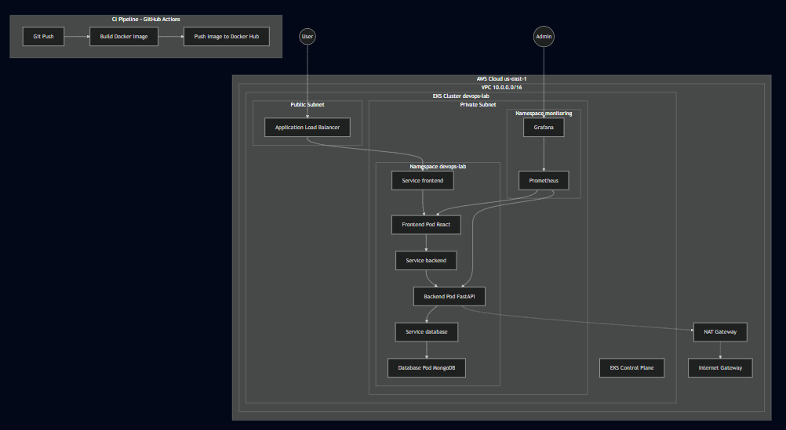
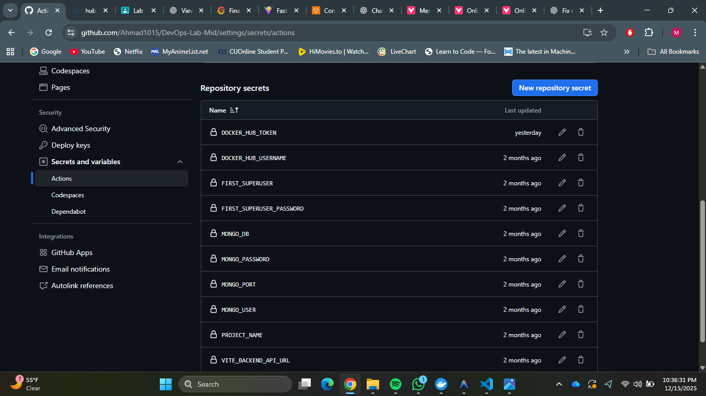
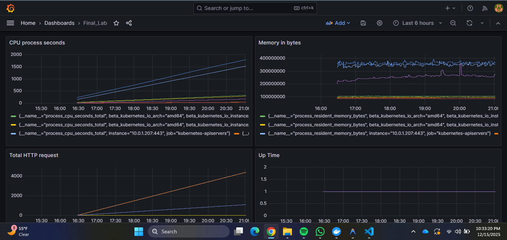
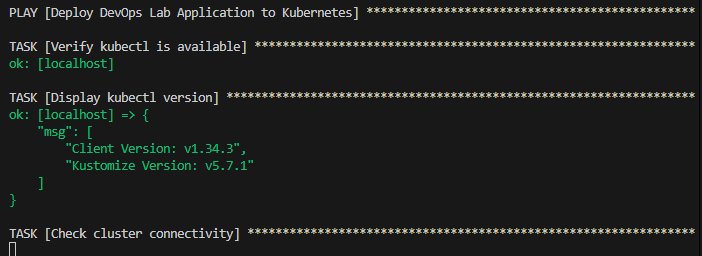
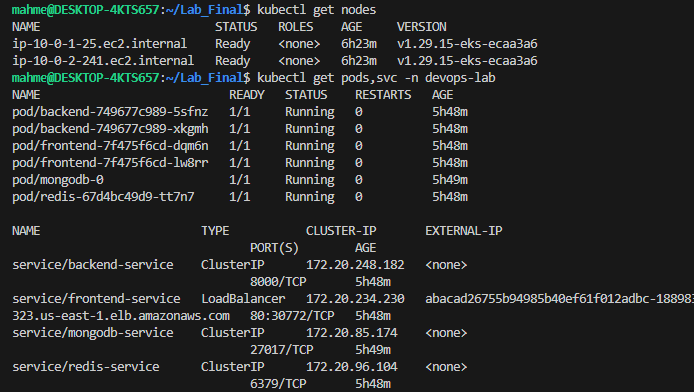
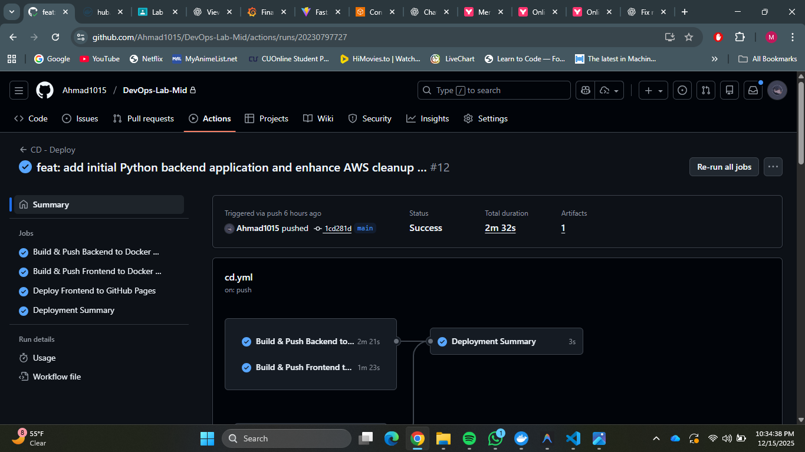

# DevOps Implementation Report

## 1. Project Overview
This report documents the implementation of a full-stack web application (FastAPI + React + MongoDB) extended with a complete DevOps lifecycle. The project demonstrates containerization, infrastructure as code Service (EKS), automated configuration management (Ansible), and observability.

## 2. Technologies Used

| Category | Technology | Purpose |
| :--- | :--- | :--- |
| **App Stack** | React (Vite), FastAPI, MongoDB | Full-stack application components |
| **Containerization** | Docker, Docker Compose | Multi-stage builds, local orchestration |
| **Infrastructure** | Terraform, AWS (EKS, VPC) | IaC for cloud provisioning |
| **Orchestration** | Kubernetes (EKS) | Production deployment & checks |
| **Config Mgmt** | Ansible | Automating K8s manifest application |
| **CI/CD** | GitHub Actions | Automated Build, Test, Push, Deploy |
| **Monitoring** | Prometheus, Grafana | Metrics collection & visualization |

---

## 3. Pipeline + Infrastructure Diagram
below is the comprehensive view of the system, connecting the Git Pipeline, the AWS Infrastructure, and the Monitoring Feedback loop.

### Explanation of Architecture
1.  **Pipeline**: Code changes trigger GitHub Actions, which builds the Docker images and uses Terraform/Ansible to update the AWS infrastructure.
2.  **Infrastructure**: A secure AWS VPC with private subnets for application logic (EKS Nodes) and public subnets for ingress (Load Balancers/NAT).
3.  **Monitoring**: Prometheus runs as a sidecar/pod, thoroughly scraping metrics from the Backend and Nodes. Grafana visualizes this for the admin.

---

## 4. Secret Management Strategy
We adhered to the "No Hardcoded Secrets" rule strictly.

### Implementation
1.  **Development**: Local secrets are stored in `.env` (gitignored).
2.  **CI/CD**: Credentials (Docker Hub Token, AWS Keys) are stored in **GitHub Repository Secrets**.
3.  **Runtime**: Secrets are injected into containers via Kubernetes **Secrets** and **ConfigMaps**.

---

## 5. Monitoring Strategy
We implemented a robust observability stack using Prometheus and Grafana.

### Components
*   **Prometheus**: Configured via ConfigMap to scrape `kubernetes-pods` and `kubernetes-nodes`. It also scrapes custom application metrics (`/metrics`) exposed by `prometheus-fastapi-instrumentator`.
*   **Grafana**: Pre-provisioned with dashboards to visualize:
    *   **Resource Usage**: CPU & Memory usage per pod.
    *   **Traffic**: HTTP Request rates (`http_requests_total`).
    *   **Health**: Pod status and availability.

---

## 6. Project Evidence (Screenshots)

### Infrastructure Provisioning (Terraform)
[Terraform](./screenshots/Terraform.png)

### Configuration Management (Ansible)

### Kubernetes Resources

### CI/CD Pipeline

---

## 7. Lessons Learned
1.  **Dependency Violations**: The hardest part was cleaning up AWS resources. Load Balancers left behind by Kubernetes prevented VPC deletion. *Solution: Enhanced cleanup script to nukes ELBs before Terraform.*
2.  **Monitoring Complexity**: Getting specific container metrics (RAM/CPU) required understanding cAdvisor vs. Endpoint scraping. *Solution: Used Python instrumentation for application-level visibility.*
3.  **State Management**: Terraform state locking can block pipelines if a job crashes. *Solution: Always use `-auto-approve` and handle cleanups graciously.*
